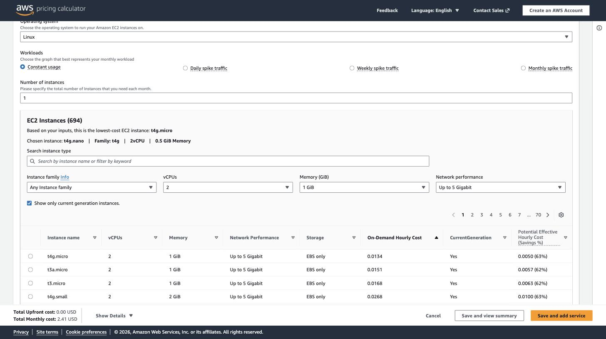
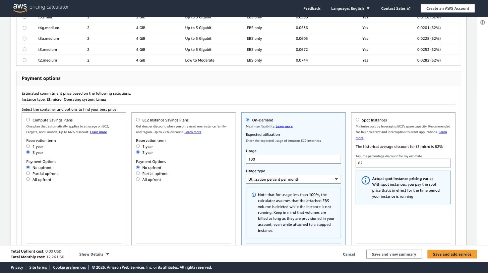
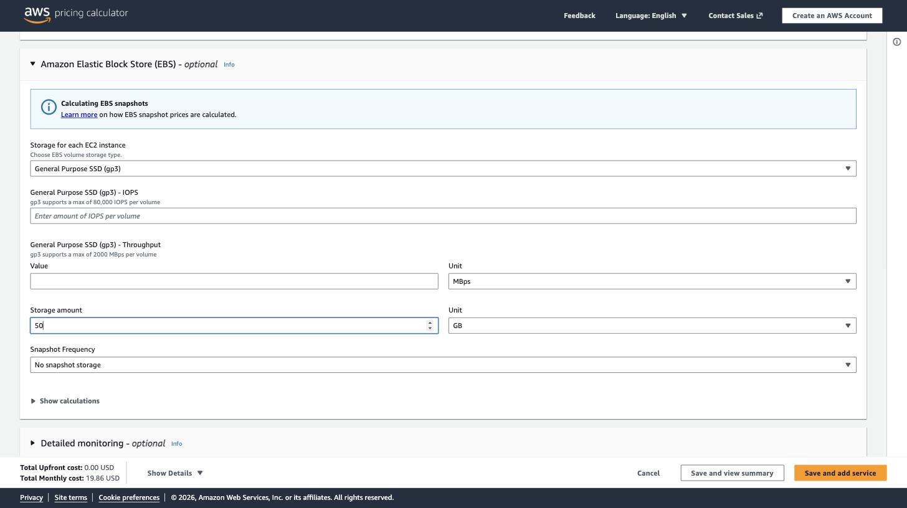
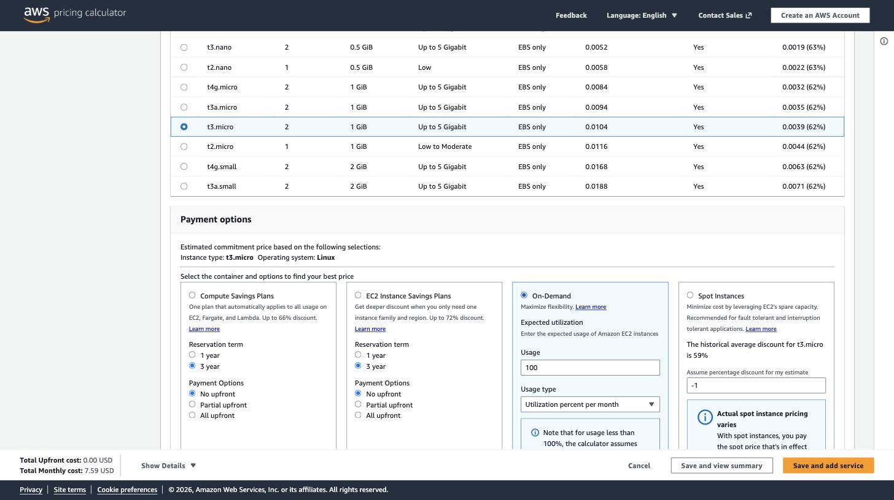
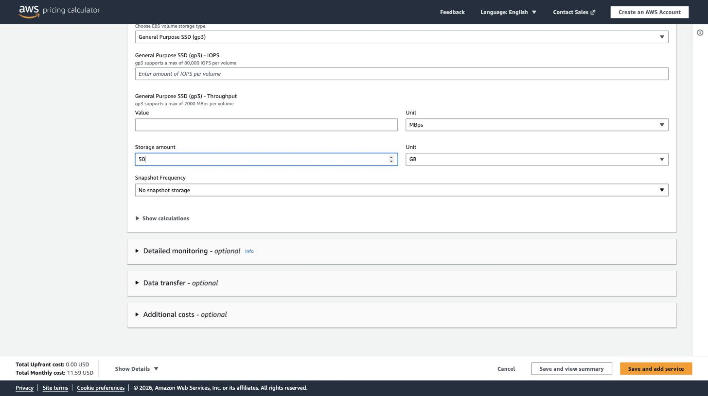
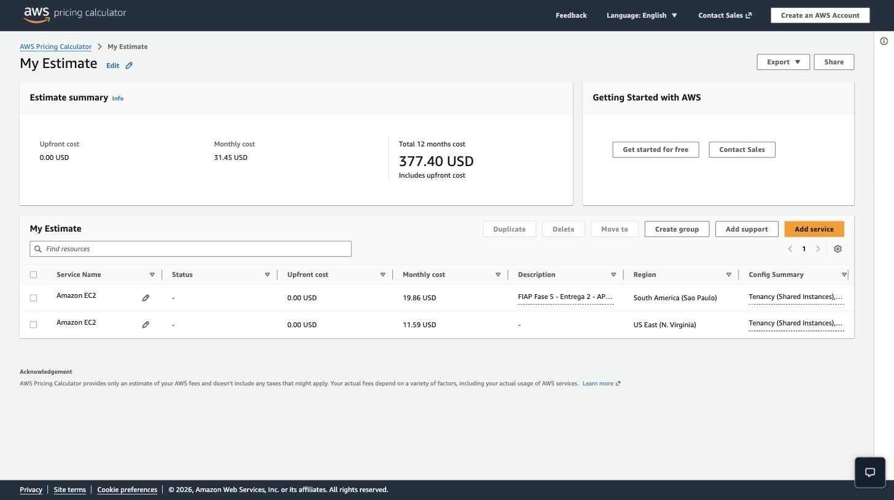
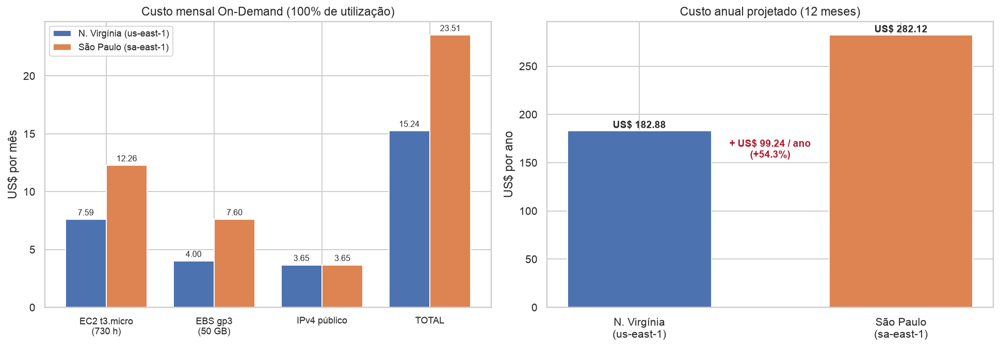

# FIAP - Faculdade de Informática e Administração Paulista

<p align="center">
<a href= "https://www.fiap.com.br/"></a>
</p>

<br>

# Fase 5 — FarmTech Solutions: previsão de rendimento de safra e infraestrutura em nuvem

## 👨‍🎓 Integrantes:
- Kaique Savi (RM 562072)

---

## 🧭 Sumário

| Entrega | Seções |
|---|---|
| — | [📜 Descrição](#descricao) |
| **1** | [Base de dados](#base) · [Estrutura do notebook](#notebook) · [Algoritmos](#algoritmos) · [Métricas](#metricas) · [Resultados](#resultados) · [Pontos fortes e limitações](#limitacoes) |
| **2** | [Especificação da máquina](#aws-spec) · [Comparativo de custos](#aws-custos) · [Evidências](#aws-evidencias) · [Justificativa da escolha](#aws-justificativa) |
| — | [📁 Estrutura de pastas](#pastas) · [🔧 Como executar](#executar) · [🗃 Histórico](#historico) · [📋 Licença](#licenca) |

<a id="descricao"></a>

## 📜 Descrição

Atividade da **Fase 5 — FIAP IA**, composta por duas entregas documentadas neste mesmo README.

A **FarmTech Solutions** presta serviços de IA para uma fazenda de médio porte — 200 hectares,
cerca de 210 campos de futebol oficiais — que produz várias culturas e coleta variáveis de solo e
clima por sensores de campo. A partir dessa telemetria, a empresa precisa **prever o rendimento
das safras** e decidir **onde hospedar** a infraestrutura que recebe esses dados.

- **Entrega 1 — Modelagem preditiva.** Notebook Jupyter aplicando o ciclo CRISP-DM sobre a base
  `crop_yield.csv`: análise exploratória, **clusterização** para revelar tendências de rendimento e
  identificar **cenários discrepantes**, e **cinco modelos de regressão** de famílias diferentes
  prevendo o rendimento, comparados por métricas pertinentes.
- **Entrega 2 — Infraestrutura.** Estimativa e comparação de custos na **Calculadora AWS** entre
  **São Paulo (`sa-east-1`)** e **Norte da Virgínia (`us-east-1`)**, com justificativa técnica e
  legal da região escolhida.

Notebook entregue: [`KaiqueSavi_rm562072_pbl_fase4.ipynb`](./KaiqueSavi_rm562072_pbl_fase4.ipynb).

> ⚠️ **Sobre o nome do arquivo.** O enunciado desta fase determina literalmente que o nome do
> notebook contenha `pbl_fase4.ipynb` (exemplo fornecido: `"JoaoSantos_rm76332_pbl_fase4.ipynb"`).
> O nome foi mantido **exatamente como especificado** para não divergir do enunciado — o conteúdo
> é o PBL da **Fase 5**.

Este README é a **porta de entrada**: apresenta o problema, a base, as decisões metodológicas e os
resultados consolidados. A análise completa, célula a célula, está no notebook.

---

<a id="entrega1"></a>

## 🌱 Entrega 1 — Modelagem preditiva do rendimento de safra

<a id="base"></a>

### Base de dados

Arquivo `crop_yield.csv`, com **156 registros × 6 colunas**, **sem valores ausentes e sem registros
duplicados**, e quatro culturas perfeitamente balanceadas (39 registros cada).

| Variável | Descrição |
|---|---|
| `Crop` | Cultura agrícola cujo rendimento está sendo medido — 4 classes: `Cocoa, beans` (cacau), `Oil palm fruit` (dendê), `Rice, paddy` (arroz), `Rubber, natural` (seringueira) |
| `Precipitation (mm day-1)` | Precipitação — ver nota de qualidade abaixo |
| `Specific Humidity at 2 Meters (g/kg)` | Vapor de água no ar por quilograma de ar seco, a 2 m do solo |
| `Relative Humidity at 2 Meters (%)` | Vapor de água como percentual do máximo suportado naquela temperatura e pressão |
| `Temperature at 2 Meters (C)` | Temperatura do ar em graus Celsius, a 2 m do solo |
| `Yield` | Rendimento colhido — **variável-alvo**. Ver nota de unidade abaixo |

#### Quatro achados sobre a estrutura da base

A exploração revelou características que não estão declaradas no enunciado e que mudaram o desenho
de toda a modelagem. Cada uma é verificada numericamente no notebook.

**1. A base é um painel, não uma amostra independente.** Existem apenas **39 combinações climáticas
distintas**, e as quatro culturas compartilham **exatamente as mesmas 39**. São 39 safras de uma
mesma região, com quatro culturas medidas em cada uma. Consequência direta: um `train_test_split`
aleatório colocaria a mesma safra no treino e no teste — com o mesmo vetor climático dos dois lados.
Por isso toda a validação é **agrupada por safra** (`GroupShuffleSplit` e `GroupKFold`).

**2. O alvo está em hg/ha, não em t/ha.** Os valores brutos vão de 5.249 a 203.399, incompatíveis
com toneladas por hectare. É o padrão **FAOSTAT** (hectograma por hectare). Após dividir por 10.000,
as médias passam a bater com a literatura agronômica (dois máximos ficam pouco acima do teto de
referência, o que é esperado: as faixas citadas são médias mundiais aproximadas, não limites físicos):

| Cultura | n | Mínimo | Média | Máximo | Desvio padrão | Faixa esperada na literatura |
|---|--:|--:|--:|--:|--:|---|
| Oil palm fruit | 39 | 14,24 | 17,58 | 20,34 | 1,49 | dendê: 10 a 20 t/ha |
| Rice, paddy | 39 | 2,47 | 3,21 | 4,26 | 0,48 | arroz em casca: 2 a 5 t/ha |
| Cocoa, beans | 39 | 0,58 | 0,89 | 1,31 | 0,17 | cacau: 0,3 a 1,0 t/ha |
| Rubber, natural | 39 | 0,52 | 0,78 | 1,03 | 0,16 | borracha natural: 0,5 a 1,5 t/ha |

**3. O rótulo da precipitação está incorreto.** A coluna se chama `Precipitation (mm day-1)`, mas os
valores vão de 1.935 a 3.086. Como precipitação diária, seriam 700 a 1.100 **metros** de chuva por
ano. São, na verdade, o **acumulado anual em mm** — coerente com clima tropical úmido e com as
culturas presentes.

**4. O efeito do clima muda de sinal entre culturas.** A correlação entre clima e rendimento
calculada sobre as 156 linhas juntas é praticamente **zero** (|r| ≤ 0,02). Mas isso é um artefato de
agregação: dentro de cada cultura o sinal existe, e aponta em direções opostas.

| Cultura | Precipitação | Umidade específica | Umidade relativa | Temperatura |
|---|--:|--:|--:|--:|
| Cocoa, beans | +0,174 | −0,055 | −0,058 | −0,010 |
| Oil palm fruit | +0,222 | +0,071 | −0,035 | +0,097 |
| **Rice, paddy** | +0,329 | **+0,697** | +0,150 | **+0,609** |
| **Rubber, natural** | +0,101 | **−0,434** | −0,054 | **−0,407** |

O arroz responde positivamente à umidade e ao calor; a seringueira responde **negativamente** às
mesmas variáveis. Misturadas, as duas se cancelam. Isso define quais famílias de modelo podem
funcionar — e é demonstrado formalmente na seção 9 do notebook.

<a id="notebook"></a>

### Estrutura do notebook (CRISP-DM)

**114 células** (71 de markdown, 43 de código), **15 gráficos**, execução completa em menos de
30 segundos.

| Seção | Conteúdo |
|---|---|
| 1. Setup | Imports, semente fixa (`RANDOM_STATE = 42`), tema visual e carga defensiva do CSV |
| 2. Entendimento do negócio e dos dados | Estatísticas descritivas, ausentes, duplicatas e a verificação numérica dos quatro achados acima, incluindo a reconstrução do identificador de safra |
| 3. Análise descritiva (EDA) | Gráficos 1 a 6: distribuição do rendimento em escala log e volatilidade por cultura · distribuições climáticas · correlação global × intra-cultura lado a lado · clima × rendimento facetado · séries temporais · relação entre as próprias variáveis climáticas |
| 4. Aprendizado não supervisionado | Clusterização das 156 linhas (resultado deliberadamente trivial) · **regimes climáticos** das 39 safras com cotovelo, silhueta, dendrograma de Ward e PCA · rendimento relativo por regime com teste de Kruskal-Wallis · **outliers por quatro métodos** com tabela de consenso |
| 5. Preparação dos dados | `ColumnTransformer` + `Pipeline` (one-hot para cultura, padronização para clima) · separação agrupada por safra · **medição numérica do vazamento** que o split aleatório causaria |
| 6. Modelagem | Duas linhas de base, os cinco algoritmos exigidos e dois extras, validados por `GroupKFold` |
| 7. Otimização | `GridSearchCV` em quatro modelos, com comparativo antes × depois |
| 8. Avaliação do melhor modelo | Métricas por cultura · previsto × real, resíduos e erro relativo · importância por permutação e árvore podada · o terceiro tipo de outlier |
| 9. Análise crítica | Quatro experimentos que testam o que o modelo realmente aprendeu |
| 10. Conclusões | Resposta às tarefas do enunciado, recomendação prática, pontos fortes, limitações e próximos passos |
| 11. Anexo — Entrega 2 | Geração reprodutível do gráfico comparativo de custos AWS |

<a id="algoritmos"></a>

### Algoritmos avaliados

Cinco **famílias diferentes**, de modo que a comparação informe sobre a natureza do problema e não
apenas sobre ajuste de hiperparâmetro:

1. **Regressão Linear** — referência interpretável, com um coeficiente por variável.
2. **Ridge** — linear com regularização L2, justificada pela multicolinearidade da base
   (precipitação × umidade relativa r = 0,75; umidade específica × temperatura r = 0,70).
3. **K-Vizinhos Mais Próximos (KNN)** — baseado em distância, sem forma funcional assumida.
4. **Árvore de Decisão** — não linear, captura interações e permite ler a lógica interna.
5. **Random Forest** — *ensemble* por *bagging*; o contraste com a Árvore isola o ganho do *ensembling*.

Dois modelos **extras**, identificados como tal: **Gradient Boosting** e **SVR com transformação
logarítmica do alvo**.

<a id="metricas"></a>

### Métricas usadas

- **MAPE** — erro percentual médio. É a **métrica de ranqueamento e de seleção**, por ser a única
  imune à diferença de escala entre culturas.
- **RMSE** e **MAE** — em t/ha, na unidade do negócio.
- **R²** — reportado por convenção, mas **enganoso nesta base** (ver abaixo).
- **Skill score intra-cultura** — `1 − SSE(modelo) / SSE(média da cultura)`. Mede o ganho real sobre
  ignorar o clima. Pode ser negativo.

**Por que o R² engana aqui.** As culturas diferem mais de 20× em rendimento, então quase toda a
variância do alvo está *entre* culturas. Um modelo que ignora completamente o clima e prevê apenas a
média histórica de cada cultura já atinge **R² = 0,9859**. Um R² de 0,99 não significa "o modelo
entendeu o rendimento" — significa "o modelo acertou qual é a cultura". Por isso o skill score
intra-cultura é reportado ao lado.

Pelo mesmo motivo o RMSE global é dominado pelo dendê, cujo rendimento é cerca de 20× o das demais
culturas e cujos erros absolutos são, por consequência, de 3 a 9 vezes maiores — ainda que seu **erro
relativo** seja o menor das quatro. Ranquear por RMSE seria ranquear por desempenho numa única cultura.

**Como o vencedor é escolhido.** A seleção usa o **MAPE da validação cruzada**, calculada apenas com
dados de treino. Escolher o melhor modelo pelo desempenho no conjunto de teste transformaria o teste
em conjunto de seleção e tornaria a métrica reportada otimista. O conjunto de teste é tocado uma única
vez, depois da escolha. Essa distinção não é acadêmica: pelo MAPE de teste o vencedor seria o Gradient
Boosting (11,14%), mas ele tem validação cruzada **pior** que a do Random Forest — o que indica que
parte da sua vantagem no teste é sorte de partição.

<a id="resultados"></a>

### Resultados resumidos

#### Clusterização — tendências de rendimento

| Item | Valor |
|---|---|
| Unidade de análise | as **39 safras**, agrupadas apenas pelo clima |
| *k* escolhido | **3**, pelo maior coeficiente de silhueta |
| Coeficiente de silhueta | **0,3987** (k=2: 0,3677 · k=4: 0,3824) |
| Confirmação independente | dendrograma com ligação de Ward |
| Variância retida em 2 componentes (PCA) | **93,4%** |

Regimes encontrados, com centróides em unidades originais:

| Regime | Safras | Precipitação (mm/ano) | Umidade esp. (g/kg) | Umidade rel. (%) | Temperatura (°C) |
|---|--:|--:|--:|--:|--:|
| Ameno e chuvoso | 17 | 2.733,52 | 18,34 | 85,65 | 26,12 |
| Quente e seco | 11 | 2.359,02 | 18,39 | 84,15 | 26,48 |
| Ameno e seco | 11 | 2.232,22 | 17,81 | 83,92 | 25,99 |

**A tendência encontrada** — rendimento médio relativo à média histórica de cada cultura:

| Regime | Cocoa, beans | Oil palm fruit | Rice, paddy | Rubber, natural |
|---|--:|--:|--:|--:|
| Ameno e chuvoso | 1,007 | 1,007 | 1,033 | 0,994 |
| Ameno e seco | 0,996 | 0,973 | **0,841** | **1,139** |
| Quente e seco | 0,993 | 1,016 | **1,108** | **0,870** |

O padrão é inequívoco e **de sinais opostos**: nos anos quentes e secos o arroz rende 11% acima da
sua média enquanto a seringueira rende 13% abaixo; nos anos amenos e secos a relação se inverte. O
teste de Kruskal-Wallis detecta diferença estatisticamente significativa **apenas nessas duas
culturas** — arroz (H = 20,84; p < 0,0001) e seringueira (H = 11,09; p = 0,0039) —, exatamente as
duas que apresentavam correlação climática intra-cultura relevante. Cacau e dendê não mostram
diferença detectável (p = 0,95 e p = 0,48).

Dois métodos independentes, um supervisionado e um não supervisionado, chegam à mesma conclusão:
**não existe "ano bom" universal para a fazenda**, e o planejamento do mix de culturas precisa
considerar isso.

#### Cenários discrepantes (outliers)

| Método | Escopo | Observações marcadas |
|---|---|--:|
| Z-score intra-cultura (\|z\| > 2) | rendimento | 3 |
| IQR intra-cultura (1,5 × IQR) | rendimento | 0 |
| Isolation Forest (39 safras) | clima | 8 |
| Local Outlier Factor (39 safras) | clima | 4 |
| **Marcadas por ao menos um método** | — | **11 de 156** |
| **Marcadas por dois ou mais métodos** | — | **4** |

A discordância entre métodos é informativa: com 39 observações por cultura e distribuições
aproximadamente simétricas, o critério de 1,5 × IQR não dispara nenhuma vez, enquanto o z-score
sinaliza três casos. Os métodos climáticos marcam **safras inteiras**, atingindo as quatro culturas
ao mesmo tempo.

**Decisão adotada: nenhum outlier foi removido.** Todas as observações são safras reais, com valores
fisicamente plausíveis; com apenas 39 safras, descartar extremos eliminaria justamente a variação que
o modelo precisa aprender; e num contexto agrícola são os anos atípicos que definem o pior e o melhor
cenário para o planejamento de risco. Os pontos permanecem sinalizados no conjunto de dados.

#### Comparação dos cinco modelos

Conjunto de teste com 40 registros de 10 safras, balanceado por construção. **Ordenado pelo MAPE da
validação cruzada**, que é o critério de seleção.

| Modelo | MAPE CV (%) | RMSE CV (t/ha) | R² teste | RMSE teste | MAE teste | MAPE teste (%) | Skill intra-cultura |
|---|--:|--:|--:|--:|--:|--:|--:|
| **5. Random Forest** | **11,66** | 0,8351 | 0,9864 | 0,8483 | 0,5012 | **12,58** | +0,0318 |
| *6. Gradient Boosting (extra)* | *12,08* | *0,8896* | *0,9897* | *0,7376* | *0,4412* | *11,14* | *+0,2679* |
| 4. Árvore de Decisão | 13,91 | 0,9476 | 0,9699 | 1,2607 | 0,7017 | 15,96 | −1,1385 |
| 1. Regressão Linear | 17,06 | 0,8257 | 0,9876 | 0,8090 | 0,5440 | 18,59 | +0,1194 |
| *7. SVR + log do alvo (extra)* | *19,90* | *2,0979* | *0,8943* | *2,3636* | *1,1144* | *22,99* | *−6,5170* |
| 2. Ridge | 22,01 | 0,8631 | 0,9836 | 0,9300 | 0,5698 | 18,14 | −0,1638 |
| 3. K-Vizinhos (KNN) | 67,35 | 2,3337 | 0,9343 | 1,8633 | 1,0757 | 50,63 | −3,6712 |
| *Baseline — média da cultura* | — | — | *0,9859* | *0,8621* | *0,5356* | *13,92* | *0,0000* |
| *Baseline — média global* | *339,08* | *6,9290* | *−0,0011* | *7,2727* | *6,0818* | *319,84* | *−70,1664* |

Três leituras que a tabela torna evidentes:

- **Apenas o Random Forest, entre os cinco algoritmos exigidos, supera a baseline** que ignora
  completamente o clima. Os demais produzem previsões piores do que simplesmente usar a média
  histórica da cultura.
- **A validação cruzada e o teste discordam sobre o segundo colocado.** O Gradient Boosting tem o
  melhor MAPE de teste (11,14%) mas fica atrás do Random Forest na validação cruzada — evidência de
  que parte da sua vantagem vem da partição específica, e a razão pela qual a seleção é feita pela CV.
- **A Regressão Linear tem skill score positivo mas MAPE pior que a baseline.** A aparente
  contradição é o melhor argumento a favor do MAPE: o skill score é construído sobre a soma dos erros
  quadráticos, dominada pelo dendê. O modelo acerta bem a cultura de maior escala e erra
  proporcionalmente muito nas três menores — o que o MAPE captura e a métrica quadrática esconde.

#### Após a otimização (GridSearchCV)

| Modelo | Melhores parâmetros | MAPE antes (%) | MAPE depois (%) | Ganho (p.p.) |
|---|---|--:|--:|--:|
| 5. Random Forest | `max_depth=None, min_samples_leaf=2, n_estimators=400` | 12,58 | **12,28** | 0,30 |
| 3. K-Vizinhos (KNN) | `n_neighbors=3, weights='distance'` | 50,63 | **13,55** | **37,08** |
| 4. Árvore de Decisão | `max_depth=None, min_samples_leaf=4` | 15,96 | 15,26 | 0,69 |
| 2. Ridge | `alpha=0.01` | 18,14 | 17,52 | 0,62 |

O ganho espetacular do KNN vem do parâmetro `weights`: ponderando os vizinhos pelo inverso da
distância, um vizinho de outra cultura — que está a √2 de distância no espaço one-hot — passa a pesar
muito menos. O KNN não era um modelo ruim para o problema; estava mal configurado para ele.

**Modelo vencedor: Random Forest otimizado** — MAPE de 11,57% na validação cruzada e **12,28% no
teste**, R² 0,9879, skill intra-cultura +0,1390, contra 13,92% da baseline.

#### Desempenho por cultura do modelo vencedor

| Cultura | n | Rendimento médio (t/ha) | RMSE (t/ha) | RMSE relativo (%) | MAPE (%) | MAPE da baseline (%) | Skill intra-cultura |
|---|--:|--:|--:|--:|--:|--:|--:|
| Oil palm fruit | 10 | 18,21 | 1,5217 | 8,36 | 6,93 | 7,77 | +0,1491 |
| Cocoa, beans | 10 | 0,91 | 0,2081 | 22,83 | 16,28 | 17,73 | +0,0516 |
| Rice, paddy | 10 | 3,25 | 0,4135 | 12,74 | 9,85 | 11,88 | +0,0480 |
| Rubber, natural | 10 | 0,83 | 0,1720 | 20,81 | 16,05 | 18,30 | **−0,1276** |

Esta é a tabela mais reveladora do trabalho, e ela desmente a métrica global. **O modelo não supera a
baseline em todas as culturas:** na seringueira o skill score é **negativo**, ou seja, prever
simplesmente a média histórica daquela cultura teria dado um resultado melhor do que usar o modelo. E
o ganho nas outras três é modesto.

O erro relativo também é muito desigual: cerca de 7% no dendê contra mais de 20% no cacau e na
seringueira. Não é coincidência — são exatamente as duas culturas de maior volatilidade (CV ≈ 20%).
**O modelo vai melhor justamente onde prever é mais fácil, e pior onde a previsão teria mais valor
prático.**

#### Análise crítica — o que o modelo realmente aprendeu

Quatro experimentos, executados no notebook, testam se o R² de 0,99 significa o que parece significar.

| Experimento | Resultado |
|---|---|
| **Remover a variável `cultura`** | R² cai para **0,0005 a −0,027** e o MAPE sobe para cerca de 300% em todos os cinco modelos. Sem saber qual é a cultura, o clima **não prevê nada**. |
| **Prever o rendimento relativo** (escala removida) | R² global de apenas **0,0351**. Por cultura: arroz 0,267 · cacau 0,136 · dendê −0,097 · seringueira **−0,247**. O padrão **não** acompanha as correlações da EDA: a seringueira, que tinha o segundo maior sinal climático, é a única com R² claramente negativo, enquanto o cacau, sem correlação alguma, fica em segundo. O sinal medido dentro da amostra não vira poder preditivo fora dela. |
| **Interação `cultura × clima`** | RMSE cai de **0,8090** (linear sem interação) para **0,7466** (com interação) e **0,7619** (quatro regressões independentes). A inferioridade dos modelos lineares é **estrutural**, não de ajuste. |
| **Correlação parcial controlando o tempo** | A correlação do arroz com a temperatura cai de **+0,609 para +0,013** (queda de 97,8%) e com a umidade específica de **+0,697 para −0,141**. O tempo sozinho explica **83,2%** da variação do rendimento do arroz. |

O último experimento é o mais importante: a correlação mais forte da base é **largamente espúria**.
O rendimento do arroz e as variáveis climáticas crescem juntos ao longo das quatro décadas por
motivos independentes — ganho tecnológico de um lado, aquecimento e umidificação da região de outro.

Uma **validação temporal** (treino nas safras 0 a 29, teste nas 30 a 38) confirma: o MAPE degrada de
12,58% para **15,81%**, contra 16,77% da baseline. O modelo mal supera a previsão trivial quando
precisa extrapolar no tempo.

Vale registrar também que o esquema de validação ingênuo (`KFold` aleatório) reporta R² de 0,9882 e
RMSE de 0,7386, contra 0,9845 e 0,8351 do `GroupKFold` agrupado por safra — ou seja,
**subestima o erro real em 11,6%**.

<a id="limitacoes"></a>

### Pontos fortes e limitações

**Pontos fortes.** Descoberta e correção de três problemas de rotulagem e estrutura da base — unidade
do alvo, rótulo da precipitação e natureza de painel dos registros —, todos verificados
numericamente no notebook e não assumidos. Validação metodologicamente correta, com agrupamento por
safra em todas as etapas e o vazamento do método ingênuo medido e reportado. Pré-processamento
inteiramente dentro de `Pipeline`, eliminando vazamento entre padronização e validação cruzada.
Linhas de base explícitas, sem as quais nenhuma métrica deste problema pode ser interpretada.
Métricas adequadas à assimetria de escala. Clusterização com retorno interpretável em unidades reais
e validada por teste de hipótese. E uma análise crítica em que cada afirmação sobre os limites do
modelo é sustentada por um experimento executado.

**Limitações.**

- **Amostra efetiva pequena:** 39 safras, não 156 observações independentes. Intervalos de confiança
  calculados sobre as 156 linhas seriam estreitos demais por um fator próximo de 2.
- **Uma única região geográfica**, o que impede avaliar generalização espacial.
- **Apenas quatro variáveis climáticas agregadas por ano.** Faltam sazonalidade intra-safra, eventos
  extremos, solo, manejo, adubação, área plantada, irrigação e pragas — fatores que a agronomia
  considera determinantes.
- **Confundimento temporal não resolvido:** a correlação mais forte da base é largamente explicada
  pela tendência conjunta de clima e tecnologia, e a base não tem variáveis que permitam separá-los.
- **Extrapolação inviável:** a amplitude térmica de toda a série é de apenas **1,25 °C**. Previsões
  fora dessa janela não têm suporte nos dados — limitação séria num cenário de mudança climática.
- **O modelo não é causal.** Descreve associações no período observado; não autoriza afirmações do
  tipo "elevar a temperatura em 1 °C aumentaria o rendimento do arroz".

**Conclusão prática para a fazenda.** O modelo **é útil para planejamento de escala** — estimar a
produção esperada do mix de culturas, dimensionar armazenagem, transporte e contratos de venda. O
modelo **não é confiável para decisões de manejo baseadas em clima**, porque não demonstrou aprender
o efeito do clima sobre o rendimento, e sim a diferença estrutural entre culturas. O caminho para o
modelo que a fazenda realmente precisa passa por dados que esta base não tem: medições intra-safra,
variáveis de solo, registro de manejo e observações de mais de uma região.

---

<a id="entrega2"></a>

## ☁️ Entrega 2 — Estimativa de custos AWS (São Paulo × Norte da Virgínia)

<a id="aws-spec"></a>

### Especificação da máquina

A FarmTech precisa de um servidor Linux para receber a telemetria dos sensores de campo, servir a API
e executar a inferência do modelo de Machine Learning da Entrega 1.

| Requisito do enunciado | Valor |
|---|---|
| Sistema operacional | Linux |
| vCPUs | 2 |
| Memória | 1 GiB |
| Desempenho de rede | Até 5 Gigabit |
| Armazenamento | 50 GB |
| Modelo de compra | **On-Demand, 100% de utilização** (730 h/mês) |

#### Qual instância atende — e por que as outras não

Filtrando a calculadora pelos requisitos mínimos (2 vCPU, 1 GiB, rede "Up to 5 Gigabit"), quatro
candidatas foram avaliadas:

| Tipo | vCPU | Memória | Rede | Arquitetura | US$/h `sa-east-1` | US$/h `us-east-1` | Atende? |
|---|:--:|:--:|---|---|--:|--:|:--:|
| t2.micro | **1** | 1 GiB | **Low to Moderate** | x86 (geração legada) | — | 0,0116 | **Não** |
| **t3.micro** | 2 | 1 GiB | Up to 5 Gigabit | x86 Intel | **0,0168** | **0,0104** | **Sim — escolhida** |
| t3a.micro | 2 | 1 GiB | Up to 5 Gigabit | x86 AMD | 0,0151 | 0,0094 | Sim |
| t4g.micro | 2 | 1 GiB | Up to 5 Gigabit | **ARM64 Graviton2** | 0,0134 | 0,0084 | Sim, com ressalva |

**A t2.micro é eliminada duas vezes.** Falha em dois dos três requisitos — tem apenas **1 vCPU**
(metade do exigido) e rede classificada como "Low to Moderate", que a AWS sequer quantifica em Gbps.
E ainda assim é **mais cara** que a t3.micro na Virgínia (US$ 0,0116 contra US$ 0,0104), apesar de
entregar metade da capacidade de processamento.

**A t4g.micro é 20% mais barata, mas foi preterida.** Ela cumpre integralmente as especificações e
custa US$ 9,78/mês em São Paulo contra US$ 12,26 da t3.micro. O porém é arquitetural: é **ARM64
(AWS Graviton2)**, não x86. Hoje isso é um obstáculo pequeno — `scikit-learn`, `numpy`, `scipy` e
`pandas` publicam *wheels* `aarch64` no PyPI, então o `pip install` funciona sem compilar. Mas a
adoção de ARM exige imagens Docker multi-arquitetura, *runners* ARM na esteira de CI e validação de
dependências de nicho. Optou-se pela **t3.micro (x86)** por compatibilidade universal, registrando a
t4g.micro como **otimização futura de aproximadamente 20% no custo de computação**.

<a id="aws-custos"></a>

### Comparativo de custos

Valores cotados na [AWS Pricing Calculator](https://calculator.aws/) em **07/09/2026**, com
`Constant usage`, `Shared Instances`, `On-Demand` e `Expected utilization = 100% Utilized/Month`.

| Componente | N. Virgínia (`us-east-1`) | São Paulo (`sa-east-1`) | Diferença | Diferença % |
|---|--:|--:|--:|--:|
| EC2 t3.micro — preço por hora | US$ 0,0104 | US$ 0,0168 | US$ 0,0064 | +61,54% |
| EC2 t3.micro — mês (730 h) | US$ 7,59 | US$ 12,26 | US$ 4,67 | +61,53% |
| EBS gp3 — 50 GB/mês | US$ 4,00 | US$ 7,60 | US$ 3,60 | +90,00% |
| **Subtotal mensal (cotado na calculadora)** | **US$ 11,59** | **US$ 19,86** | **US$ 8,27** | **+71,35%** |
| **Subtotal em 12 meses** | **US$ 139,08** | **US$ 238,32** | **US$ 99,24** | **+71,35%** |
| IPv4 público — mês (730 h) | US$ 3,65 | US$ 3,65 | US$ 0,00 | 0,00% |
| **TOTAL MENSAL** | **US$ 15,24** | **US$ 23,51** | **US$ 8,27** | **+54,27%** |
| **TOTAL EM 12 MESES** | **US$ 182,88** | **US$ 282,12** | **US$ 99,24** | **+54,27%** |

Três decisões técnicas embutidas nesta tabela merecem registro:

**Por que gp3 e não gp2.** O gp3 é cerca de 20% mais barato pelo mesmo volume **e** entrega 3.000
IOPS de linha de base inclusos, contra 3 IOPS por GB do gp2 — que em 50 GB seriam apenas 150 IOPS,
vinte vezes menos. É simultaneamente mais barato e muito mais rápido. O tipo foi mantido idêntico
nas duas regiões; comparar gp2 numa e gp3 na outra invalidaria a comparação.

**Por que o IPv4 público entra na conta.** Desde 1º de fevereiro de 2024 a AWS cobra **US$ 0,005 por
hora** por endereço IPv4 público, mesmo com a instância em execução, e o preço é **uniforme em todas
as regiões**. São US$ 3,65 por mês — o equivalente a **48% do custo da própria instância** na
Virgínia. A calculadora não adiciona esse item automaticamente, e ele costuma ser esquecido nas
estimativas. Fonte: [AWS VPC Pricing](https://aws.amazon.com/vpc/pricing/).

**Um detalhe revelador:** a diferença absoluta é **idêntica (US$ 8,27/mês) com ou sem o IPv4**,
porque o endereço custa o mesmo nas duas regiões. Ele apenas dilui o percentual, de +71,35% para
+54,27%. Todo o "prêmio Brasil" está concentrado em computação e armazenamento.

#### Transferência de dados — o custo que não penaliza este caso de uso

| Item | `us-east-1` | `sa-east-1` |
|---|--:|--:|
| **Entrada** de dados (sensores → API) | **US$ 0,00** | **US$ 0,00** |
| Franquia mensal gratuita de saída para a internet | 100 GB | 100 GB |
| Saída para a internet acima da franquia | US$ 0,09/GB | US$ 0,15/GB |

A entrada de dados é **gratuita em todas as regiões da AWS**. Como o fluxo dominante deste sistema é
de entrada — os sensores enviam telemetria —, o custo de transferência **não penaliza o caso de uso
principal**. Ele aparece apenas no retorno (respostas da API e dashboards). E vale notar o
contra-argumento: se a API estivesse na Virgínia, todo dado que voltasse ao Brasil pagaria saída
atravessando cabo submarino. O custo não é eliminado ao migrar — é trocado por latência.

<a id="aws-evidencias"></a>

### Evidências

**1. Filtro por requisitos mínimos** — 2 vCPU, 1 GiB e rede "Up to 5 Gigabit", mostrando as
instâncias que atendem à especificação do enunciado:



**2. Configuração da instância — São Paulo (`sa-east-1`)** — t3.micro, Linux, `Shared Instances`,
`Constant usage`, **On-Demand com 100% de utilização**:



**3. Armazenamento — São Paulo** — EBS `General Purpose SSD (gp3)` com 50 GB, totalizando
US$ 19,86/mês:



**4. Configuração da instância — Norte da Virgínia (`us-east-1`)** — mesma especificação, mesmo
modelo de compra. Note na tabela a **t2.micro com 1 vCPU e rede "Low to Moderate"**, mais cara que a
t3.micro:



**5. Armazenamento — Norte da Virgínia** — EBS gp3 de 50 GB, totalizando US$ 11,59/mês:



**6. Comparativo consolidado** — as duas estimativas na mesma tela, com o total de 12 meses:



**7. Gráfico comparativo** — gerado de forma reprodutível na seção 11 do notebook:



<a id="aws-justificativa"></a>

### Justificativa da escolha

**A solução mais barata é a Virgínia do Norte. A região escolhida é São Paulo.**

Do ponto de vista estritamente financeiro, `us-east-1` custa **US$ 11,59/mês** contra
**US$ 19,86/mês** de `sa-east-1` — ou US$ 15,24 contra US$ 23,51 incluindo o IPv4 público. O
sobrepreço da região brasileira é de **US$ 8,27 por mês** e **US$ 99,24 por ano**. Ainda assim, a
recomendação é hospedar em São Paulo, por dois eixos que o preço não captura.

#### 1. Acesso rápido aos dados dos sensores — latência

A latência medida entre `sa-east-1` e `us-east-1` é de aproximadamente **115 ms**, contra cerca de
**2 ms** dentro da própria região de São Paulo e algo em torno de 14 ms entre São Paulo e Brasília.
É uma diferença de quase uma ordem de grandeza.

O impacto é **multiplicativo, não aditivo**. Uma requisição HTTPS nova consome **três tempos de ida e
volta** antes do primeiro byte útil — handshake TCP, handshake TLS 1.3, e o par requisição/resposta.
Para um sensor que abre conexão a cada leitura, padrão comum em firmware de microcontrolador:

| Destino | RTT | 3 RTT (TLS 1.3) |
|---|--:|--:|
| São Paulo → `sa-east-1` | ~10 ms | **~30 ms** |
| São Paulo → `us-east-1` | ~115 ms | **~345 ms** |

As consequências práticas:

- **Vazão do sensor.** A 345 ms por transação, um dispositivo sustenta cerca de 3 leituras por
  segundo; a 30 ms, cerca de 30. Uma malha de sensores de irrigação de precisão satura o enlace muito
  mais cedo contra a Virgínia.
- **A banda não resolve.** A janela de congestionamento do TCP cresce **por RTT**. Com um RTT onze
  vezes maior, conexões curtas — que é exatamente o formato do payload de um sensor — nunca saem do
  *slow start*. A rede "de até 5 Gigabit" da instância é irrelevante: o gargalo é o tempo de ida e
  volta, não a largura de banda.
- **Enlaces rurais.** O tempo de retransmissão do TCP é derivado do RTT. Em link 4G instável no
  campo, a perda de um pacote custa uma penalidade de recuperação muito maior com 115 ms do que com
  10 ms, e o erro se compõe.
- **Inferência em tempo real.** Se a decisão é acionar ou não uma válvula de irrigação agora, gastar
  345 ms apenas em rede consome o orçamento de latência inteiro antes de o modelo ser invocado. Em
  São Paulo, a rede vira ruído estatístico e o tempo passa a ser dominado pelo modelo — que é onde
  ele deve estar.

Vale a honestidade técnica: parte desse custo é mitigável com conexões persistentes (`keep-alive`,
retomada de sessão TLS, MQTT). Mas **nenhuma dessas técnicas reduz o RTT de base** — elas apenas
evitam pagá-lo repetidamente. O piso é físico: são cerca de 7.600 km de cabo submarino, e a
velocidade da luz na fibra não é negociável.

#### 2. Restrições legais para armazenamento no exterior

É preciso ser tecnicamente preciso aqui: **a LGPD não proíbe a transferência internacional de dados
pessoais.** A Lei nº 13.709/2018 a submete a um **regime de condições**, nos artigos 33 a 36.
Hospedar em `us-east-1` seria juridicamente viável, desde que o controlador constituísse e mantivesse
um dos mecanismos do art. 33 — na prática, as **Cláusulas-Padrão Contratuais** do Anexo II da
**Resolução CD/ANPD nº 19/2024**, publicada no DOU em 23/08/2024 e de adoção obrigatória sem
modificações. O prazo de adequação de contratos preexistentes **encerrou-se em 23/08/2025**, de modo
que se trata de obrigação vigente, não de risco futuro. A esse encargo somam-se o registro das
operações de tratamento, a avaliação de risco e, conforme o caso, o Relatório de Impacto à Proteção
de Dados Pessoais.

**Mas dados de sensores agrícolas são dados pessoais?** Isoladamente, não — medições de umidade,
temperatura e precipitação são fenômenos físicos. O ponto é que o dado do sensor não trafega sozinho:

- Ele carrega a **coordenada geográfica do talhão**. No Brasil, a maioria dos estabelecimentos rurais
  tem como titular uma **pessoa natural**, e o cruzamento da coordenada com bases públicas como o CAR
  identifica o produtor. Dado que identifica pessoa natural por meios razoavelmente disponíveis é
  dado pessoal, pelo conceito de "identificável" do art. 5º, I.
- A **própria API gera dados pessoais inequívocos**: usuário, e-mail, token, endereço IP, logs de
  acesso e, havendo aplicativo de campo, geolocalização do operador. Tudo isso trafega pela mesma
  API, para o mesmo banco, na mesma região.
- Uma base de sensores raramente permanece isolada: ela evolui para incluir contratos, cooperados,
  técnicos de campo e crédito rural. Uma arquitetura que só é conforme enquanto o escopo permanece
  congelado não é uma arquitetura conforme.

E há argumentos que se sustentam **mesmo que nada disso fosse dado pessoal**. Produtividade por
talhão e curva de resposta a insumos são **segredo de negócio** de alto valor competitivo. Mais
relevante: o **US CLOUD Act (2018)** autoriza autoridades norte-americanas a requisitar dados sob
custódia de provedores sujeitos à sua jurisdição, inclusive armazenados fora dos Estados Unidos.
Hospedar em `us-east-1` não é apenas uma transferência internacional — é submissão voluntária a um
foro estrangeiro, criando potencial conflito com o próprio art. 33, III da LGPD, que exige cooperação
jurídica internacional. Manter os dados em `sa-east-1` não elimina integralmente essa exposição, mas
a reduz materialmente e mantém a custódia física em território nacional, com o Marco Civil da
Internet (Lei nº 12.965/2014, arts. 10 e 11) aplicável de forma inequívoca.

#### 3. Conclusão

O sobrepreço de São Paulo é de **US$ 8,27 por mês** — **US$ 99,24 por ano**, ou +54,27% sobre a conta
com IPv4. Em valores absolutos, menos de nove dólares mensais.

O que esses nove dólares compram:

- **Latência cerca de dez vezes menor**, e este é o único item que nenhuma outra decisão de
  arquitetura consegue comprar, porque é limitado pela velocidade da luz na fibra.
- **Eliminação da hipótese de transferência internacional** — não mitigação, eliminação. Sem
  cláusulas-padrão, sem avaliação de adequação, sem relatório de impacto transfronteiriço, e com
  exposição materialmente reduzida ao CLOUD Act.
- **Elegibilidade a clientes públicos e a contratos privados** que exigem residência de dados em
  território nacional, hoje um requisito recorrente no agronegócio brasileiro.

Uma única hora de assessoria jurídica especializada em proteção de dados custa mais do que o
sobrepreço anual inteiro, e nenhuma otimização de custo compra 113 milissegundos de volta.

**Decisão: São Paulo (`sa-east-1`), instância `t3.micro` com Linux, volume EBS gp3 de 50 GB e um
endereço IPv4 público — US$ 23,51 por mês, US$ 282,12 por ano.**

A Virgínia do Norte faria sentido apenas para **treinamento em lote** de modelos sobre dados
agregados ou anonimizados, onde a latência é irrelevante e não há dado pessoal envolvido. Não é o
caso da ingestão de sensores, que é o objeto desta estimativa.

> **Nota de dimensionamento.** A configuração do enunciado (1 GiB de RAM) é o **piso funcional**, não
> o dimensionamento recomendado para produção: apenas os imports de `numpy`, `scipy` e `scikit-learn`
> consomem entre 150 e 250 MB de memória residente. Um cenário real exigiria *swap* em EBS ou uma
> `t3.small` com 2 GiB. Registra-se ainda que instâncias da família T operam em modo `unlimited` por
> padrão, com linha de base de 10% de CPU por vCPU — inferência sustentada acima disso gera cobrança
> de créditos excedentes a US$ 0,05 por vCPU-hora, valor idêntico nas duas regiões.

#### Fontes

| Fonte | Uso |
|---|---|
| [AWS Pricing Calculator](https://calculator.aws/) | Todos os valores de EC2 e EBS das duas regiões, cotados em 07/09/2026 |
| [Amazon VPC Pricing](https://aws.amazon.com/vpc/pricing/) | Preço do IPv4 público (US$ 0,005/h, uniforme entre regiões) |
| [Amazon EC2 On-Demand Pricing](https://aws.amazon.com/ec2/pricing/on-demand/) | Franquia global de 100 GB/mês de saída para a internet |
| [Amazon EC2 T3 Instances](https://aws.amazon.com/ec2/instance-types/t3/) | Especificações da família T3 e créditos de CPU excedentes |
| [AWS EC2 Instance Types — General Purpose](https://docs.aws.amazon.com/ec2/latest/instancetypes/gp.html) | Especificações de t2, t3, t3a e t4g |
| [Lei nº 13.709/2018 (LGPD)](https://www.planalto.gov.br/ccivil_03/_ato2015-2018/2018/lei/l13709.htm) | Arts. 5º, I e 33 a 36 |
| [ANPD — Transferência Internacional de Dados](https://www.gov.br/anpd/pt-br/assuntos/assuntos-internacionais/transferencia-internacional-de-dados) | Resolução CD/ANPD nº 19/2024 |
| [Lei nº 12.965/2014 (Marco Civil da Internet)](https://www.planalto.gov.br/ccivil_03/_ato2011-2014/2014/lei/l12965.htm) | Arts. 10 e 11 |

---

<a id="pastas"></a>

## 📁 Estrutura de pastas

Dentre os arquivos e pastas presentes na raiz do projeto, definem-se:

```
fiap-ia-fase5-farmtech/
├── assets/
│   ├── logo-fiap.png                        # Logo da FIAP usada neste README
│   └── aws/                                 # Evidências da Entrega 2
│       ├── 01-filtro-requisitos.jpg         # Filtro por 2 vCPU, 1 GiB e rede até 5 Gigabit
│       ├── 02-config-instancia-sao-paulo.jpg # t3.micro On-Demand 100% em sa-east-1
│       ├── 03-ebs-gp3-50gb-sao-paulo.jpg    # EBS gp3 de 50 GB em sa-east-1
│       ├── 04-config-instancia-virginia.jpg # t3.micro On-Demand 100% em us-east-1
│       ├── 05-ebs-gp3-50gb-virginia.jpg     # EBS gp3 de 50 GB em us-east-1
│       ├── 06-comparativo-estimativas.jpg   # As duas estimativas na mesma tela
│       └── 07-grafico-comparativo.png       # Gráfico gerado na seção 11 do notebook
├── KaiqueSavi_rm562072_pbl_fase4.ipynb      # Notebook da entrega, executado e com saídas
├── crop_yield.csv                           # Base de dados do enunciado (156 × 6)
├── build_notebook.py                        # Script que gera o notebook via nbformat
├── requirements.txt                         # Dependências mínimas para reproduzir
├── .gitignore                               # Ignora venv, checkpoints, cache e .DS_Store
└── README.md                                # Este arquivo
```

<a id="executar"></a>

## 🔧 Como executar o código

### Opção A — Google Colab

1. Faça o upload de `KaiqueSavi_rm562072_pbl_fase4.ipynb` para o Colab.
2. Descomente a linha `!pip install` na primeira célula de código, se necessário.
3. **Ambiente de execução → Executar tudo.**

O notebook baixa o `crop_yield.csv` deste repositório automaticamente caso o arquivo não esteja
presente na sessão, então não é necessário fazer upload da base.

### Opção B — Local (venv)

```bash
git clone https://github.com/KaiqueSavi/fiap-ia-fase5-farmtech.git
cd fiap-ia-fase5-farmtech

python3 -m venv .venv
source .venv/bin/activate
pip install -U pip
pip install -r requirements.txt

# Abrir no Jupyter:
jupyter notebook KaiqueSavi_rm562072_pbl_fase4.ipynb

# Ou regenerar o notebook a partir do script e executá-lo pelo terminal:
python build_notebook.py
jupyter nbconvert --to notebook --execute --inplace \
  KaiqueSavi_rm562072_pbl_fase4.ipynb \
  --ExecutePreprocessor.timeout=900
```

O notebook é **gerado por `build_notebook.py`** usando `nbformat`, o que mantém o conteúdo
versionado como código e garante que a execução seja sempre linear e reprodutível. A execução
completa leva menos de 30 segundos.

<a id="historico"></a>

## 🗃 Histórico de lançamentos

* 0.1.0 - 07/09/2026

<a id="licenca"></a>

## 📋 Licença

<p xmlns:cc="http://creativecommons.org/ns#" xmlns:dct="http://purl.org/dc/terms/"><a property="dct:title" rel="cc:attributionURL" href="https://github.com/agodoi/template">MODELO GIT FIAP</a> por <a rel="cc:attributionURL dct:creator" property="cc:attributionName" href="https://fiap.com.br">Fiap</a> está licenciado sobre <a href="http://creativecommons.org/licenses/by/4.0/?ref=chooser-v1" target="_blank" rel="license noopener noreferrer" style="display:inline-block;">Attribution 4.0 International</a>.</p>
